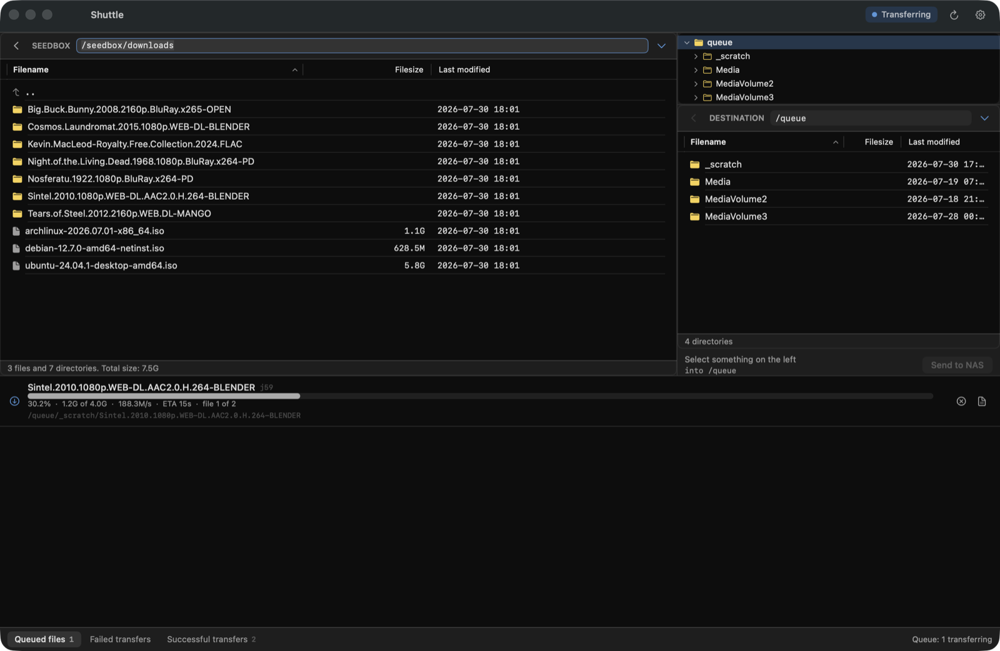

# Shuttle

A pared-back, FileZilla-shaped client for moving files from a seedbox to a NAS —
where the part that actually does the copying lives somewhere other than the
machine you're clicking on.



## Why

FileZilla's two-pane layout is the right shape for this job. Its engine is in the
wrong place. Point FileZilla at a seedbox and a NAS and every byte detours through
whatever laptop happens to have the window open — twice over the same Wi-Fi, at
the mercy of the lid staying up.

The common fix is to mount the seedbox on the NAS and copy locally. That works,
and leaves you maintaining a FUSE mount and a mirror of a filesystem you never
wanted a copy of.

Shuttle keeps the interface and relocates the engine. The panes, the queue, the
draggable splitters and the transfer list all behave roughly the way you expect,
but nothing is transferred by the app: a small service on the NAS talks straight
to the seedbox and streams server-to-server. Your Mac sends instructions and
renders progress. Close the lid mid-copy and the copy carries on.

It is deliberately smaller than FileZilla. Two panes, one queue, no site manager,
no protocol zoo, no delete.

## How it fits together

```
  macOS app  ──HTTP──▶  relay (Docker, on the NAS)  ──rclone──▶  seedbox
   Shuttle              browse · queue · progress                FTPS/FTP/SFTP
   the controls               │                                  the source
                              └──writes──▶  your media volumes
```

- **`macapp/`** — SwiftUI, built with plain `swiftc`. No Xcode project.
- **`relay/`** — Python, stdlib only, in Docker. Queues jobs, runs `rclone`,
  reports progress. Also exposes an optional FTP front end, so FileZilla itself
  can drive the same queue if you'd rather.

## Requirements

- A NAS that runs Docker. The relay image installs `rclone` itself.
- macOS 14 or later to run the app; Xcode's command line tools to build it.
- A private network path from the Mac to the NAS. Tailscale is what this was built
  against; any VPN or plain LAN works. **Do not expose the relay to the internet** —
  it writes into your volumes.

## Setup

### 1. The relay

```bash
git clone https://github.com/adamkbritsch/shuttle.git
cd shuttle/relay
cp .env.example .env
```

Edit `.env`: set `RELAY_API_TOKEN` to a fresh secret, point `RELAY_API_BIND` at
your NAS's private address, and set `DEST_1` to a directory you want to copy into.

```bash
python3 -c "import secrets; print(secrets.token_urlsafe(32))"   # a token
docker compose up -d
```

With no token the HTTP API does not start at all. That is deliberate.

### 2. The app

```bash
cd ../macapp
./build.sh --install          # builds and installs to ~/Applications
```

Open Shuttle, then **Settings**:

- **Address** — `http://<nas-private-ip>:8789`
- **API token** — the one from `.env`
- **Seedbox** — protocol, host, port, username, password

Saving the seedbox settings tests the connection *from the NAS*, because the NAS
is the machine that has to reach the seedbox. A successful test from your Mac
would prove nothing about whether transfers will run.

Credentials are stored on the NAS in `relay/data/seedbox.json` (mode 0600,
gitignored) and reach rclone as `RCLONE_CONFIG_*` environment variables, so there
is no `rclone.conf` to maintain.

## What it does

- **Two-pane browsing** with draggable, persisted splitters, sortable columns and
  a directory tree per side.
- **Server-to-server transfers** with live progress, cancel, and a queue depth you
  can cap.
- **Conflict handling.** When files already exist at the destination it asks
  instead of overwriting, offering FileZilla's actions: overwrite, overwrite if
  newer, overwrite if size differs, overwrite if size differs or newer, rename, or
  skip. Each maps to the rclone flag that implements it.
- **Deferred rename.** Rename something mid-transfer and it is applied when the
  copy finishes — surviving both a closed laptop and a relay restart.

### Two things it deliberately does not do

**Resume.** FileZilla offers "resume file transfer"; rclone restarts an interrupted
file from zero. Rather than offer a button that lies about what will happen, the
option is absent.

**Delete.** There is no delete anywhere in the app. It moves things into your
library; unmaking that decision is your file manager's job.

## Safety

The relay writes into media volumes, so the guard rails are load-bearing:

- Every path is validated in one place (`relay/app/guards.py`) before a job exists,
  and normalised *before* the prefix check, so `..` cannot climb out.
- Destinations are limited to what you mounted under `/srv/tree/queue`. The browser
  builds its root from the guard's own view, so a destination the guard would
  reject is never even offered.
- A source shallower than an individual release is refused, so a whole library
  level cannot be queued by accident.
- Free space is checked before a job is queued rather than discovered mid-copy.

## Licence

MIT — see [LICENSE](LICENSE).

Not affiliated with FileZilla, rclone, or any seedbox provider.
