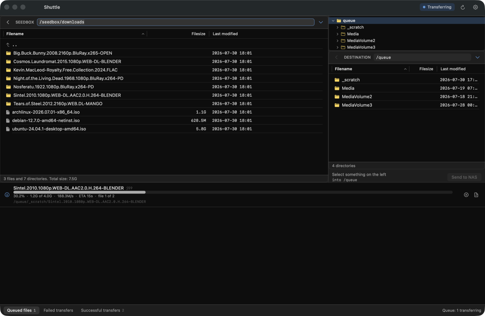

<p align="center">
  
</p>

A pared-back, FileZilla-shaped client for bringing files home from a remote server
to your NAS — where the thing doing the carrying is never the machine you're
clicking on.



## Why

FileZilla's two-pane layout is the right shape for this job. Its engine is in the
wrong place. Point FileZilla at a remote server and a NAS and nothing comes home
directly: every byte detours through whatever laptop has the window open, twice
over the same Wi-Fi, for exactly as long as the lid stays up.

Shuttle keeps the interface and relocates the engine. The panes, the queue, the
draggable splitters and the transfer list all behave roughly the way you expect,
but the app itself never carries anything: a small service on the NAS goes and
fetches, straight from the remote server. Your Mac points at what should come
home and watches it arrive. Close the lid mid-run and the run carries on without
you.

It is deliberately smaller than FileZilla. Two panes, one queue, no site manager,
no protocol zoo.

### Prior art

[AList](https://github.com/AlistGo/alist) is the closest general-purpose
alternative, and a more capable program than this one: it speaks to dozens of
storage backends, remote file servers among them, and will copy between any two
of them from a browser. If you want one pane of glass over every cloud you own,
use AList.

The cost of that generality is that the operation has to be assembled each time —
choose a storage, navigate it, select, find the copy action, pick a target
storage, navigate that. Shuttle only does one thing, so there is nothing to
assemble: the two panes are already the two ends of the transfer, and the only
verb is to **come home**.

## How it fits together

```
  macOS app  ──HTTP──▶  relay (Docker, on the NAS)  ──rclone──▶  remote server
   Shuttle              browse · queue · progress                FTPS/FTP/SFTP
   the controls               │                                  out there
                              └──writes──▶  home: your media volumes
```

- **`macapp/`** — SwiftUI, built with plain `swiftc`. No Xcode project.
- **`relay/`** — Python, stdlib only, in Docker. Queues jobs, runs `rclone`,
  reports progress. Also exposes an optional FTP front end, so FileZilla itself
  can drive the same queue if you'd rather.

## Install

**1. Download and unzip.** Grab `Shuttle-vX.Y.Z.zip` from
[Releases](https://github.com/adamkbritsch/shuttle/releases) and unzip it.

**2. Drag `Shuttle.app` to `/Applications`. This is required, not tidiness.**
macOS App Translocation runs a quarantined app from a randomised, read-only path
when it is opened anywhere else — Downloads included. Moving it out of quarantine
by putting it in `/Applications` is what stops that.

**3. Right-click it and choose Open**, once. The app is signed but not notarised,
so double-clicking gets refused the first time; Open from the context menu offers
the "open anyway" button. After that it launches normally.

**4. Do the rest inside the app.** Shuttle opens with a **Setup** panel that walks
through every field it needs, each with a live check beside it:

| | |
|---|---|
| **Relay connection** | Address and API token. **Find my relay** sweeps this network for one, so an address you do not know is not a dead end. **Save & Test** proves both halves separately — whether anything answered, and whether it accepted the token. |
| **Remote server** | The credentials the *relay* uses. They are stored on the NAS and never sent back; the app only ever learns whether a password is set. **Save & Test** runs a real listing rather than a ping. |
| **Relay on the NAS** | The one part that cannot be done from here, as a numbered checklist with a copy button per command and a re-check that turns green once the relay answers. |
| **Destinations** | The volumes the relay reports, so you can see where transfers can land before sending one. |

The panel stays open until everything passes and collapses afterwards, and a
**Finish setting up** banner sits on the main window until then.

### The relay, on the NAS

This is step 3 of the panel, reproduced here for anyone who would rather read it
first. The relay is a container; the app cannot install it remotely.

```bash
git clone https://github.com/adamkbritsch/shuttle.git
cd shuttle/relay
cp .env.example .env
```

Fill in `.env`. Every key needs a value of your choosing — there are no defaults
and none are printed here:

| Key | What it is |
|---|---|
| `RELAY_API_TOKEN` | A fresh secret. With no token the HTTP API does not start at all, deliberately. |
| `RELAY_API_BIND` | The NAS's private address. **Never `0.0.0.0`** — the relay writes into your volumes. |
| `FTP_BIND_ADDR` | Same, for the FTP front end. |
| `PUID` / `PGID` | The owner transfers should land as. |

```bash
python3 -c "import secrets; print(secrets.token_urlsafe(32))"   # a token
docker compose up -d
curl -s http://localhost:8789/healthz                           # should answer
```

Credentials for the remote server are stored on the NAS in
`relay/data/seedbox.json` (mode 0600, gitignored) and reach rclone as
`RCLONE_CONFIG_*` environment variables, so there is no `rclone.conf` to maintain.

### Building it yourself (development)

Not needed to use Shuttle — the Release zip is the supported path.

```bash
cd macapp
./build.sh --install              # build, install to ~/Applications
./build.sh --release 1.1.0        # build, stamp the version, zip into dist/
```

`--release` produces `dist/Shuttle-vX.Y.Z.zip` with `ditto -c -k --keepParent`,
which preserves the code signature; a zip made any other way can arrive with a
signature Gatekeeper refuses outright.

`SHUTTLE_RELAY_HOST=<host> ./build.sh` bakes in a default address so a fresh
install opens already pointing somewhere. It is optional — the app allows any
host you configure at runtime, which is what makes a downloaded build usable by
someone other than whoever built it.

## Requirements

- A NAS that runs Docker. The relay image installs `rclone` itself.
- macOS 14 or later. Building additionally needs Xcode's command line tools.
- A private network path from the Mac to the NAS. Tailscale is what this was built
  against; any VPN or plain LAN works. **Do not expose the relay to the internet** —
  it writes into your volumes.

## What it does

- **Two-pane browsing** with draggable, persisted splitters, sortable columns and
  a directory tree per side. Names sort the way Finder sorts them, so `Episode 2`
  comes before `Episode 10` instead of after it.
- **Server-to-server transfers** — the NAS fetches, the Mac watches. Live progress,
  cancel, and a queue depth you can cap.
- **Conflict handling.** When files already exist at the destination it asks
  instead of overwriting, offering FileZilla's actions: overwrite, overwrite if
  newer, overwrite if size differs, overwrite if size differs or newer, rename, or
  skip. Each maps to the rclone flag that implements it.
- **Deferred rename.** Rename something mid-transfer and it is applied when the
  copy finishes — surviving both a closed laptop and a relay restart. Renaming
  something on the remote server uses the same mechanism in reverse: it starts the
  transfer and names the copy on arrival, leaving the source untouched, because the
  filename is what the thing serving it tracks.
- **Housekeeping on either side** — rename and delete from the right-click menu,
  on the NAS and on the remote server alike; new folders on the NAS side. A landing
  folder can be tidied and a badly named release corrected at the source, without
  opening Finder or a second client. Delete confirms with the file count and size.
- **Bulk rename.** Select several items and rename them in one pass: find and
  replace, add a prefix or suffix, or number them sequentially. A live preview
  shows every old and new name, and Apply stays disabled until the whole set is
  collision-free. The renames are ordered so a batch that shuffles names among
  itself — renumbering `01…05` to start at `02`, say — applies cleanly rather than
  failing partway through.
- **A queue that does what you asked.** Adding the same thing twice queues it once.
  Adding several things at once transfers them in name order, and the relay starts
  them in the order they were queued rather than whichever worker happened to wake
  first.
- **Replace.** Right-click something on the NAS and choose Replace, then pick what
  should take its place — either from that item's own right-click menu, which names
  what it is replacing, or with the button in the send bar. The new copy transfers
  first and the old item is deleted only once it has landed **and** been checked
  against the source; if the copy fails or comes up short, both are kept. When both
  sides share a name it is an overwrite in place and nothing is deleted afterwards.
- **Move.** Right-click anything on the NAS and choose Move to open a small folder
  browser: go up, look inside, pick a folder, or name a new one. Move Here targets
  whatever folder you are looking at, which is how something moves *up* to sit
  beside the folder it was in. It stays on one volume — a move across volumes is a
  copy, and the app says so rather than failing halfway. A name clash asks whether
  to replace or come in under a different name.
- **The destination can be this Mac.** A picker in the destination pane's header
  switches it between the NAS and the machine you are sitting at, browsing
  anywhere on it. With the Mac selected the SOURCE pane grows its own picker, so
  either the remote server or the NAS can feed it — that picker is hidden the rest
  of the time, because with the NAS on both sides it would only offer to move
  something to where it already is.

  Bytes always come through the relay, and that is the point rather than a
  shortcut. The Mac talks only to the NAS, over the private network the app
  already uses — so this works from a network that blocks the remote server
  outright, which a direct connection would not. It also means no server
  credentials live on the Mac and nothing is staged on the NAS's disk; the relay
  reads each file and streams it straight through. On the same LAN the extra leg
  costs nothing measurable, since the internet leg is crossed once either way and
  is the bottleneck regardless.

  Because that path is expected to be the slow, awkward one, it is built for it:
  a manifest gets a four-minute budget rather than the usual one, and a file that
  dies mid-transfer is retried once — a dropped socket on a captive-portal network
  should not cost a whole release.

  Two honest differences from a NAS transfer. **It stops if you quit Shuttle** —
  the relay's queue survives a restart because it runs on the NAS, and this one
  cannot; every local row says so. And **Delete on the Mac goes to the Trash**
  rather than being final, which is what stands in for the depth guard the relay
  applies to its own volumes. Search on the Mac side is Spotlight, so it answers
  in milliseconds instead of walking from `/`.
- **Uploads.** The remote server is a destination as well as a source, so either
  pane can be any of the three and Send goes whichever way you point it. A folder
  keeps its shape on arrival, and New Folder works on the remote side too.
  From the NAS it is an ordinary relay job — it survives quitting, and gets retry
  and the log like any other. From this Mac it streams up through the relay, which
  pipes it straight to the remote server rather than staging it on the NAS disk.
  One caveat stated rather than hidden: a Mac-side upload overwrites what is
  already there instead of asking, because the "what is already at the
  destination" scan reads a local filesystem and the remote server is not one.
- **Resumable reads.** `GET /v1/fetch` honours `Range: bytes=N-` and answers 206,
  seeking on the NAS side and passing the offset to rclone on the remote side, so
  a dropped connection on a large pull continues instead of starting over. Only
  the single open-ended form is accepted; anything else is refused rather than
  quietly served whole, which would corrupt the file being appended to.
- **Listings refresh themselves** when there is a reason to. A finished transfer
  reloads the destination pane if that is the folder you are looking at, so the
  file appears where you are watching for it rather than after a manual refresh.
  Coming back to the window reloads the NAS side if it has been sitting a while.
  Both are skipped while a dialog is open, and neither touches the remote side:
  that listing costs an FTP round trip, so it is refreshed when you ask and not
  on a timer.
- **Retry** a failed transfer from the Failed tab: it re-queues the same source and
  destination rather than making you find them again.
- **Free space** shown for the destination volume, so the number that would
  otherwise arrive as a rejection is visible before you queue anything.
- **Search** either side, recursively, from the right-click magnifier or ⌘F. The
  NAS side walks every destination volume at once; the remote side asks rclone for
  one recursive listing. Results show what matched and the folder it is in, and
  picking one takes you there — a folder opens, a file's folder opens with the file
  selected. Results are find-only by design: nothing destructive is reachable from
  a list whose rows come from all over the tree.
- **Filter** either pane, collapsed behind an icon beside Search. Client-side over
  the listing already fetched, so typing never triggers a fresh directory read —
  which is what makes it instant and what makes Search a separate thing.

### One thing it deliberately does not do

**Resume.** FileZilla offers "resume file transfer"; rclone restarts an interrupted
file from zero. Rather than offer a button that lies about what will happen, the
option is absent.

## Safety

The relay writes into media volumes, so the guard rails are load-bearing:

- Every path is validated in one place (`relay/app/guards.py`) before a job exists,
  and normalised *before* the prefix check, so `..` cannot climb out.
- Destinations are limited to what you mounted under `/srv/tree/queue`. The browser
  builds its root from the guard's own view, so a destination the guard would
  reject is never even offered.
- A source shallower than an individual release is refused, so a whole library
  level cannot be queued by accident. The same depth rule governs renaming and
  deleting on the remote side, so a whole level cannot be modified by accident
  either.
- Anything a transfer is currently writing into, or reading from, is refused rather
  than quietly pulled out from under `rclone`.
- Free space is checked before a job is queued rather than discovered mid-copy.

Changes on the remote server are made by `rclone` talking to it directly, not
through the mount the relay reads from — that is bound read-only, on purpose.
Deleting there is real and irreversible, and anything still serving those files
from that server will be affected. Shuttle moves and removes files; it does not
manage whatever put them there.

## Licence

MIT — see [LICENSE](LICENSE).

Not affiliated with FileZilla, rclone, AList, or any hosting provider.

---

<p align="center">
  
</p>
